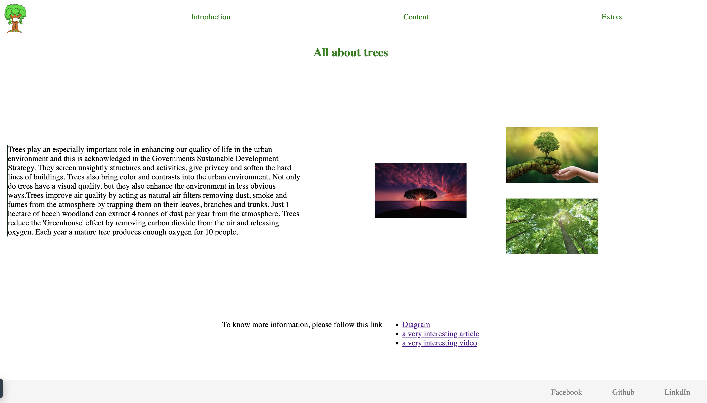

# All About Trees

> The All About Trees project is a web-based resource dedicated to providing
> information and educational material about trees. The project aims to provide
> a comprehensive guide about trees, for nature lovers, and students interested
> in learning about trees, their types, their importance to the environment, and
> how to care for them.

## Table of contents

- [All About Trees](#all-about-trees)
  - [Table of contents](#table-of-contents)
  - [General info](#general-info)
  - [Screenshots](#screenshots)
  - [Technologies](#technologies)
  - [Setup](#setup)
  - [Status](#status)
  - [Group Members](#group-members)

## General info

> The project will be developed using HTML, CSS, and will be hosted on a public
> repository on GitHub.

## Screenshots

## Technologies

- Html
- VSC code
- Css

## Setup

- `npm run start`

## Status

Project is: _done_

## Group Members

| Name                                          |
| --------------------------------------------- |
| [Inna](https://github.com/inna9Z)             |
| [Himanshi](https://github.com/himanshisaxena) |
| [Karol](https://github.com/karol10cano)       |
| [Zahira](https://github.com/ZahiraBella)      |
| [Rahatab](https://github.com/Rahatab)         |
