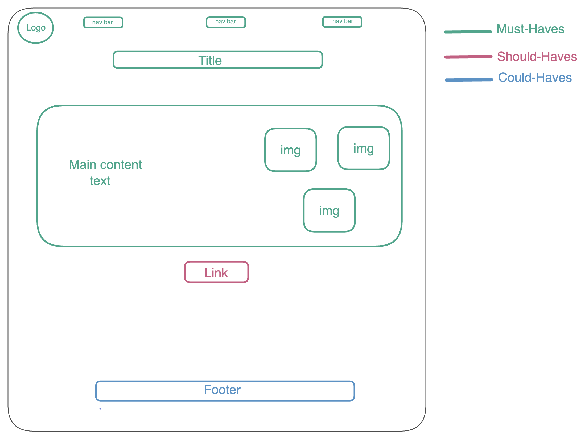

# All-about-trees

---

## User Story Dependencies

[Story Dependency Diagram](user-personas.md)

---

## WIREFRAME

 -->

---

## 0.Setup

- create a new repo form the template `template-html-css`
- add collaborators
- turn on github pages and give them `write` access
- protect `main` branch

---

## 1. Title

### As a user I want to see the title of the page under the navigation bar

- This user story is developed on branch `1-title`.
- This branch is merged to `main` branch after completion.

### html

- add `header` tag
- add `h1` for the page title

### css

- add class`centered-item` to the `header`
- make the display `flex` and add `padding`

## 2. Logos

### As a user I want to see the logo in the left-top of the page

- This user story is developed on branch `2-logos`.
- This branch is merged to `main` branch after completion.

### html

- add one `img`

### css

- add class `ouncy-img` to both `img`
- add `width` and `height`
- add `keyframes`
- add `hover`

## 3. Navigation links

### As a user I want to see navigation links

- This user story is developed on branch `3-navLinks`.
- This branch is merged to `main` branch after completion.

### html

- add two `nav`
- add a `div` parent
- add `a`

### css

- add class `bottom-divider` to both `nav`
- add `border`
- add class `spaced-items` to the parent `div`
- make display `flex` and add `padding`

## 4. Description

### As a user I want to see description of the page

- This user story is developed on branch `4-description`.
- This branch is merged to `main` branch after completion.

### html

-add ‘photos’

- add `section`
- add `p`

### css

- add id `summary-info` to both `section`
- add class `fascinating-words` to `p`
- make the font family `fantasy`

## 5. links

### As a user I want to see extra link one the page

- This user story is developed on branch `5-Link`.
- This branch is merged to `main` branch after completion.

### html

- add `aside`
- add `p`
- add `a`

### css

- add id `extra-info` and class `aside-info` to both `aside`
- add `width`, `padding`, `margin`, `box-shadow`, `float`
- add class `aside-text` to `p`
- change font family to `monospace`

## 6. Social media links

### As a user I want to see social media links to contact the website owner

- This user story is developed on branch `6-socialMedia`.
- This branch is merged to `main` branch after completion.

### html

- add `footer`
- add `a`

### css

- add class `top-divider` and `spaced-items` to `footer`
